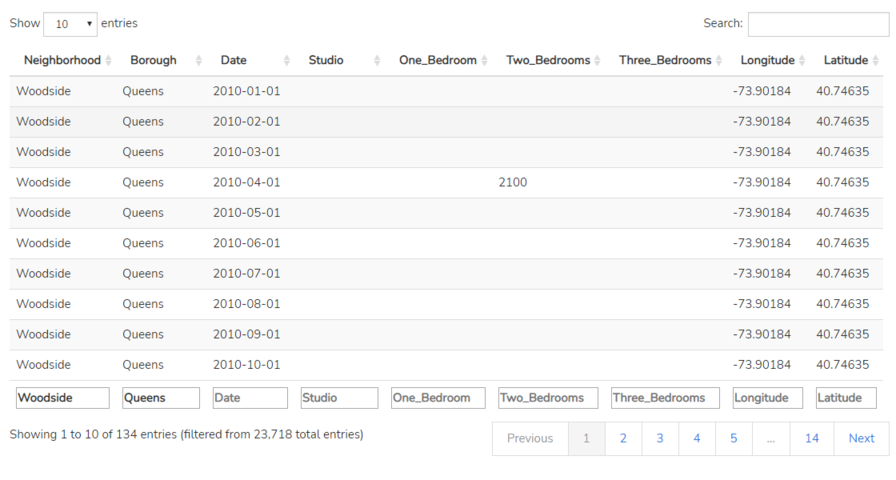

```{r setup, include=FALSE}
knitr::opts_chunk$set(echo = TRUE)
```

<!-- CSS STYLES --->

<style>
@import url('https://fonts.googleapis.com/css2?family=Bitter:ital,wght@1,500&family=Nunito&display=swap');
* {
  font-family: 'Nunito', sans-serif;
}
#header h1 {
  font-family: 'Bitter', serif;
  font-size: 46px;
  font-weight: bold;
}
h2 {
  font-size: 26px;
  font-weight: bold;
}
</style>

<!-- CSS STYLES -->

NYC Rent Explorer is a shiny application that utilizes New York City renting data 
in order to analyze rent pricing trends. It examines how different apartment types
and areas of NYC has changed over time.

The usefulness of the app

The github repository can be found [here](https://github.com/STAT-413-613-21S/fp_final-project-cjy)


## Map and Time Series Analysis

The first tab allows the user to select a NYC borough (Manhattan, Brooklyn, Queens, Bronx)
and a neighborhood corresponding to the chosen borough.

Once the user has done that, the map will automatically update, showing the physical location
of the neighborhood in NYC. Below the map, a time series chart displays how the median rent of the selected
neighborhood and apartment type (default studio) has changed over time.

The user has the option to view the median price time series for different apartment types by using the 
"Select an apartment type" drop-down menu.

## Compare Neighborhoods

## Time Series Forcast

## Data Spreadsheet

The final tab of NYC Rent Explorer is simply master data spreadsheet that is used 
in order to create the charts and data analysis of the previous sections.

The data will automatically filter and update based on user input. If the user wants to look
at the raw data for Woodside, Queens, they simply type in the neighborhood and borough name:




## Required Packages


## Data Source and Structure

NYC Rent Explorer sources its data from [StreetEasy.com](https://streeteasy.com/blog/download-data/),
which is a company that focuses in analyzing real estate in New York City. 

NYC Rent Explorer is in no way related nor sponsored with [StreetEasy.com](https://streeteasy.com/blog/download-data/)

## EDA Inputs, Controls, and Outputs


## Statistical Analysis Inputs, Controls, and Outputs


## References